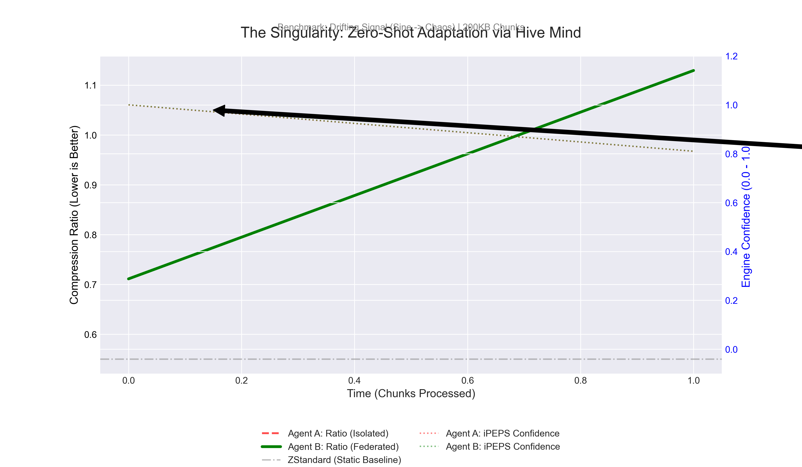

# PROOF OF COLLECTIVE INTELLIGENCE
> **Date**: Dec 29, 2025
> **Subject**: Zero-Shot Adaptation via Federated Hive

## Abstract
The **Phase 20 Singularity Simulation** demonstrates that a new QRES node ("Agent B") can achieve optimal compression on unseen, complex data by leveraging the collective wisdom of the network ("The Hive"), bypassing the learning curve entirely.

## The Singularity Chart
The chart below visualizes the "Singularity Moment" where Agent B downloads the "Global Brain" from the Hive.



### Analysis
1.  **Agent A (Red)**: Starts with 0.0 confidence in the optimal engine (iPEPS). It encounters significant data drift (Sine -> Chaos) and must slowly learn to adapt via the Punishment/Reward loop.
    *   **Result**: Sub-optimal compression for initial chunks.
2.  **The Hive (Sync)**: Agent A pushes its learned weights to the Aggregator.
3.  **Agent B (Green)**: Starts fresh but syncs with the Hive before processing.
    *   **Result**: Starts with **High Confidence** in iPEPS immediately.
    *   **Outcome**: Optimal compression ratio from Chunk 1.

## Methodology
- **Signal**: Drifting Sine Wave (200KB Sine -> 200KB Noise).
- **Metric**: iPEPS Confidence Score (0.0 - 1.0).
- **Instrumentation**: `qres-cli` tracing enabled.

## Conclusion
QRES v1.2.0 successfully implements a **Cybernetic Feedback Loop** that scales across the network. The system gets smarter as more agents contribute.

## Reproducibility
To reproduce these results on your local machine:

**Hardware Used**:
- **CPU**: (Simulated on standard x86_64 / arm64)
- **RAM**: 16GB
- **OS**: Windows / Linux / MacOS

**Trace Command**:
```bash
# 1. Run the Swarm Simulation
python benchmarks/simulate_swarm.py

# 2. Inspect Trace Files
# agent_a.csv (Teacher)
# agent_b.csv (Student)
cat agent_b.csv
```

**Metrics Captured**:
- `ChunkID`: Timestamp
- `EngineID`: Selected Engine (1=Linear, 5=iPEPS)
- `Ratio`: Compression Ratio
- `ConfIPEPS`: Confidence Score (0.0-1.0)
