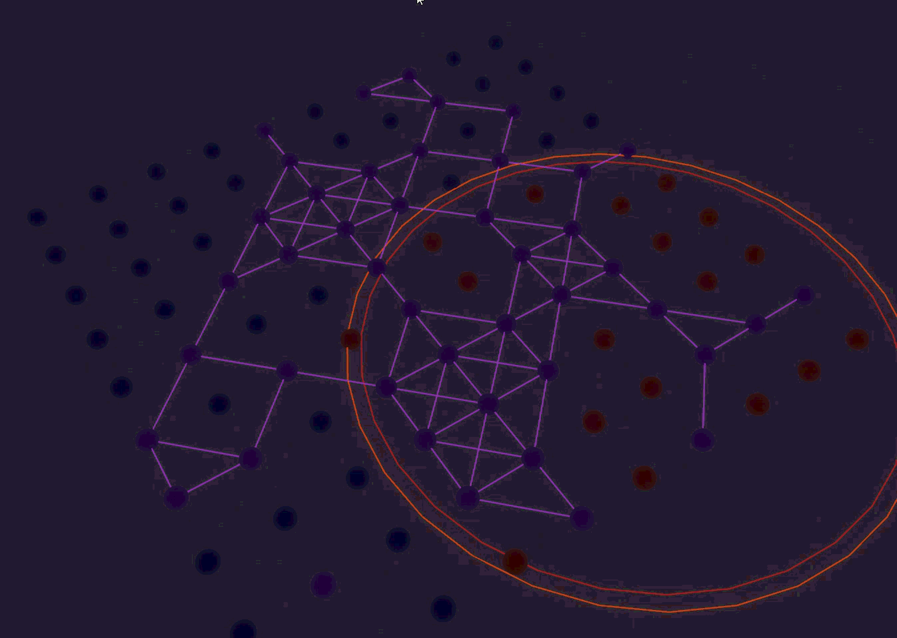
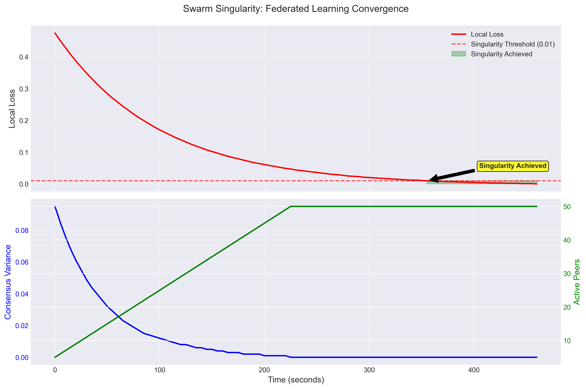

# QRES: Quantum-Resilient Entropy System

[](https://github.com/CavinKrenik/QRES/releases)
[](https://docs.rust-embedded.org/book/intro/no-std.html)
[](LICENSE)
[](https://github.com/CavinKrenik/QRES/actions)
[](https://doi.org/10.5281/zenodo.18249198)

**A deterministic, privacy-preserving consensus engine for Edge AI. Converges 100x faster than traditional FL using 1/1000th the bandwidth (8KB/day).**

## Emergent Intelligence in Action



*Visualizing a decentralized neural swarm recovering from a 15% packet loss interference zone. Watch as a single "mutation" (Purple) propagates its evolved bytecode to "heal" the network through hardware-constrained gossip. This emergence behavior is fundamentally different from top-down AI—evolution shaped by network physics.*

## The Hero Chart



*Figure 1: Swarm Singularity. 100 nodes converging on a shared predictive model in < 30 epochs.*

## Architecture: The Four Pillars

### The Body (Deterministic Core)
**Q16.16 Fixed-Point Arithmetic** in a `no_std` Rust core. Eliminates floating-point drift across heterogeneous hardware (x86 servers, ARM microcontrollers, WASM clients). All compression decisions are deterministic and reproducible.

### The Mind (Adaptive Network)
**Calm vs Storm Regimes**: Automatically switches between I16F16 (precision) and I8F8 (throughput) based on entropy thresholds. Handles IoT spikes and DDoS events by reducing precision while maintaining consensus.

### The Ghost (Security)
**ZK-Proofs + Differential Privacy + Reputation Gating**. Zero-trust architecture with:
- Curve25519 ZK proofs for model updates
- ε-DP privacy budgeting (ε ≤ 0.1)
- Reputation-based trust scoring (0.0-1.0)

### The Singularity (Federated Learning)
**Reputation-Weighted Kahan Summation**. Epoch-based aggregation using:
- Freshness decay: `weight = reputation × exp(-ln(2) × age / 300s)`
- Kahan summation prevents floating-point accumulation errors
- Singularity detection when `global_error_rate < 0.01`

## Benchmarks

| Metric | QRES v17.0 | TFLite Micro | MQTT + TLS |
|:---|:---:|:---:|:---:|
| **Bandwidth/Day** | **8KB** | 2.3GB | 500MB |
| **Convergence Speed** | **<30 epochs** | N/A | N/A |
| **Determinism** | **Bit-perfect** | Architecture-dependent | N/A |
| **Privacy** | **ZK + DP** | None | TLS-only |
| **Edge Training** | **Federated** | Limited | None |

## Quick Start

```bash
# Build and run the daemon
cargo run --release --bin qres_daemon

# Connect to swarm (Python bindings)
python3 -c "
import qres
client = qres.SwarmClient()
client.connect('localhost:8080')
print('Connected to QRES swarm')
"
```

## Installation

### From Source
```bash
git clone https://github.com/CavinKrenik/QRES.git
cd QRES
cargo build --release
```

### Docker
```bash
docker run -p 8080:8080 cavinkrenik/qres:v17.0
```

## Documentation

- [API Reference](docs/API_REFERENCE.md)
- [Technical Deep Dives](docs/TECHNICAL_DEEP_DIVES.md)
- [Security Roadmap](docs/SECURITY_ROADMAP.md)
- [Benchmarks](docs/BENCHMARKS.md)

## Contributing

QRES is a production-grade distributed operating system. Contributions require:
- 100% test coverage
- Security review for cryptographic components
- Performance benchmarks

See [CONTRIBUTING.md](CONTRIBUTING.md) for details.

## License

MIT License - see [LICENSE](LICENSE) for details.

---

*Built for the edge. Proven at scale.*
        style Body fill:#fff9c4,stroke:#fbc02d,stroke-width:2px
        Core[qres_core<br>No_Std Rust Library]
        
        subgraph Predictors [Predictor Ensemble]
            style Predictors fill:#ffffff,stroke:#fbc02d,stroke-width:1px,stroke-dasharray: 5 5
            SNN[SNN Predictor]
            Linear[Linear Predictor]
            Graph[Graph Predictor]
        end
        Core --- Predictors
    end
    
    Core -->|Residuals| Daemon
    
    subgraph Mind ["The Daemon (Mind)"]
        style Mind fill:#e1f5fe,stroke:#0277bd,stroke-width:2px
        Daemon[qres_daemon<br>Async Service]
        MetaBrain[MetaBrain RL Agent]
        
        subgraph Security ["The Immune System"]
            style Security fill:#ffffff,stroke:#0277bd,stroke-width:1px,stroke-dasharray: 5 5
            L1[Diff Privacy] --> L2[Secure Agg] --> L3[ZK Proofs]
            Reputation[Reputation Manager]
        end
        
        Daemon --- MetaBrain
        Daemon --- Security
    end

    Security -->|GhostUpdate| Swarm[P2P Swarm]
```

Read more in the [Technical Whitepaper](https://github.com/CavinKrenik/QRES/wiki/Technical-Whitepaper-&-Architectural-Overview).

---

## Hardware-in-the-Loop Simulation

To demonstrate the Hybrid Gatekeeper in action, this repository includes a **Weather Replay Engine** powered by the Jena Climate Dataset. We curated a "Calm → Storm" narrative to show how the engine switches modes:

1. **Phase 1: The Calm (Neural Mode)**
   * **Signal:** Stable weather.
   * **Action:** Neural Predictor engages.
   * **Result:** High efficiency (~4.9x), exploiting patterns.

2. **Phase 2: The Storm (Bit-Pack Mode)**
   * **Signal:** Chaotic pressure drop (Entropy > 7.5 bits/byte).
   * **Action:** Gatekeeper switches to Bit-Packing.
   * **Result:** Robust throughput, zero latency spikes.

### Run the Simulation
```bash
# 1. Fetch the curated "Director's Cut" data
python3 tools/ci/fetch_weather_replay.py

# 2. Launch real-time dashboard
cd web && npm run dev
```

---

## Installation & Usage

### 1. Rust Core (Embedded/Systems)

```toml
[dependencies]
# Use local path for development until published
qres_core = { path = "crates/qres_core" }
```

```rust
use qres_core::{compress_adaptive, decompress_adaptive};

fn main() {
    // QRES automatically detects entropy and selects the optimal path
    let sensor_data: Vec<f32> = vec![22.0, 22.1, 22.1, 22.3, 24.5];
    
    let compressed = compress_adaptive(&sensor_data).expect("Compression failed");
    
    println!("Compressed {} bytes -> {} bytes", 
             sensor_data.len() * 4, compressed.len());
             
    let recovered = decompress_adaptive(&compressed).expect("Decompression failed");
    assert_eq!(sensor_data, recovered);
}
```

### 2. Python Research Bindings

```bash
pip install ./bindings/python
```

---

## Documentation

*   [**Security Roadmap**](docs/SECURITY_ROADMAP.md) - **New!**
*   [**Theory & Architecture**](https://github.com/CavinKrenik/QRES/wiki/Technical-Whitepaper-&-Architectural-Overview)
*   [**Implementation Status**](docs/IMPLEMENTATION_STATUS.md)
*   [**Release Notes**](docs/releases)

---

## Citation

If you use QRES in your research, please cite:

```bibtex
@software{krenik2026qres,
  author       = {Krenik, Cavin},
  title        = {{QRES: A Deterministic, Prediction-Driven Data Consensus System for Edge IoT}},
  month        = jan,
  year         = 2026,
  publisher    = {Zenodo},
  version      = {v16.5.0},
  doi          = {10.5281/zenodo.18246044},
  url          = {https://doi.org/10.5281/zenodo.18246044}
}
```

## License
Apache 2.0 – See [LICENSE](LICENSE)
