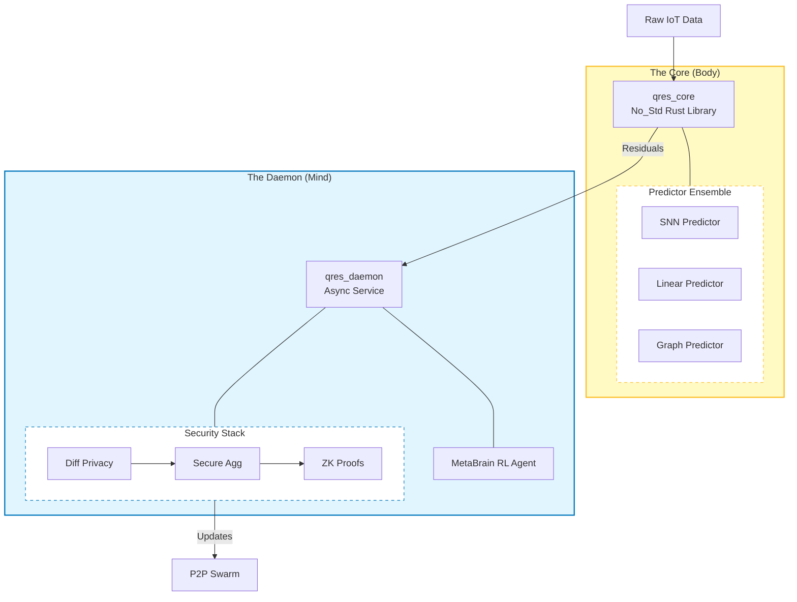

# QRES: An Adaptive Hybrid Compression System for Edge IoT

> A biologically-inspired neural compression engine for the constrained edge.

[](https://doi.org/10.5281/zenodo.18216348)
[](https://orcid.org/0009-0008-9183-1278)
[](LICENSE)
[](https://github.com/CavinKrenik/QRES/actions)
[](https://github.com/CavinKrenik/QRES/releases)

**Paper:** [Download PDF](docs/paper/QRES__An_Adaptive_Hybrid_Compression_System_for_Edge_IoT.pdf) | **DOI:** [10.5281/zenodo.18216348](https://doi.org/10.5281/zenodo.18216348)

---

## The Core Idea: Hybrid Adaptive Compression

Time-series data at the edge presents a unique contradiction: some signals are highly structured (weather, vibrations), while others are noisy and chaotic (grid load spikes). Traditional compressors treat them all the same.

**QRES (Quantized Residual Entropy System)** introduces a **Hybrid Gatekeeper** that dynamically switches between two compression paths based on real-time entropy analysis:

1.  **Bit-Packing Path (Low-Latency):** For high-entropy data (e.g., Grid Sensors), QRES strips trends using Delta+ZigZag encoding and packs the residuals directly. This bypasses the heavy neural network, saving CPU while maintaining ~2.8x compression.
2.  **Neural-Enhanced Path (High-Ratio):** For structured data (e.g., Manufacturing, ECG), QRES activates a lightweight Neural Residual Predictor. This squeezes out an additional **25%** compression by modeling the physics of the signal.

The result is a system that never "expands" data and adapts its computational cost to the difficulty of the signal.

---

## Validated Performance (v16)

Benchmarks run on single-core generic hardware. QRES automatically bypasses Neural prediction when entropy is high (> 7.5 bits/byte).

| Dataset | Domain | Ratio | Architecture Used |
|:---|:---|:---:|:---|
| **SmoothSine** | Synthetic | **24.9x** | Neural + BitPack |
| **Jena Climate** | Weather | **4.9x** | BitPack Dominant |
| **ItalyPower** | Smart Grid | **4.6x** | Neural + BitPack |
| **Wafer** | Manufacturing | **4.2x** | Neural + BitPack |
| **ECG5000** | Medical | **4.0x** | Neural + BitPack |
| **ETTh1** | Grid Sensor | **2.8x** | BitPack Only (Bypass) |

---

## The "Living Brain" Architecture

QRES adopts a bio-mimetic architecture that separates deterministic execution (**The Body**) from adaptive learning (**The Mind**). This ensures bit-perfect reproducibility while allowing the system to "dream" and adapt to new data regimes.



Read more in [**QRES Theory**](docs/THEORY.md).

---

## Hardware-in-the-Loop Simulation

To demonstrate the Hybrid Gatekeeper in action, this repository includes a **Weather Replay Engine** powered by the Jena Climate Dataset. We curated a "Calm → Storm" narrative to show how the engine switches modes:

1.  **Phase 1: The Calm (Neural Mode)**
    *   **Signal:** Stable weather.
    *   **Action:** Neural Predictor engages.
    *   **Result:** High efficiency (~4.9x), exploiting patterns.

2.  **Phase 2: The Storm (Bit-Pack Mode)**
    *   **Signal:** Chaotic pressure drop (Entropy > 7.5 bits/byte).
    *   **Action:** Gatekeeper switches to Bit-Packing.
    *   **Result:** Robust throughput, zero latency spikes.

### Run the Simulation
```bash
# 1. Fetch the curated "Director's Cut" data
python3 scripts/fetch_weather_replay.py

# 2. Launch real-time dashboard
cd qres-studio && npm run dev
```

---

## Installation & Usage

```toml
[dependencies]
qres = "0.16.0"
```

```rust
use qres_core::{compress_adaptive, decompress_adaptive};

fn main() {
    // QRES automatically detects structure and chooses the Neural Path
    let sensor_data: Vec<f32> = vec![22.0, 22.1, 22.1, 22.3, 24.5];
    
    let compressed = compress_adaptive(&sensor_data).unwrap();
    
    println!("Compressed {} bytes -> {} bytes", 
             sensor_data.len() * 4, compressed.len());
             
    let recovered = decompress_adaptive(&compressed).unwrap();
    assert_eq!(sensor_data, recovered);
}
```

---

## Documentation

*   [**Theory & Architecture**](docs/THEORY.md)
*   [**Implementation Status**](docs/IMPLEMENTATION_STATUS.md)
*   [**Product Roadmap**](docs/PRODUCT_ROADMAP.md)
*   [**Release Notes**](docs/releases)

---

## Citation

If you use QRES in your research, please cite:

```bibtex
@software{krenik2026qres,
  author       = {Krenik, Cavin},
  title        = {{QRES: An Adaptive Hybrid Compression System for Edge IoT}},
  month        = jan,
  year         = 2026,
  publisher    = {Zenodo},
  version      = {v16.0.0},
  doi          = {10.5281/zenodo.18216348},
  url          = {https://doi.org/10.5281/zenodo.18216348}
}
```

## License
Apache 2.0 – See [LICENSE](LICENSE)
