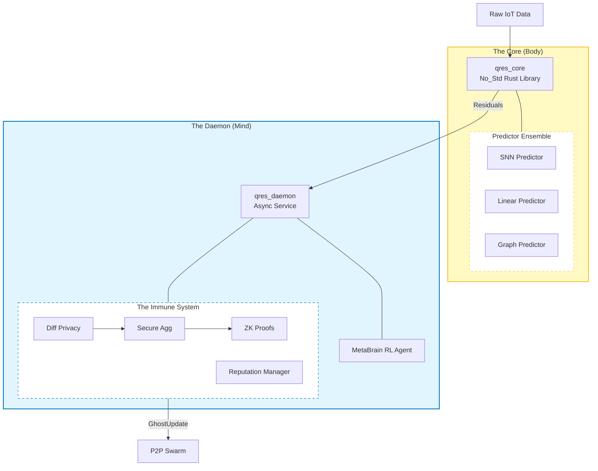

# QRES: A Deterministic Data Consensus System for Edge IoT

> **Produce. Predict. Preserve.**

[](https://doi.org/10.5281/zenodo.18246044)
[](https://github.com/CavinKrenik/QRES/actions)
[](LICENSE)

**QRES** is a distributed system that solves the "Bandwidth vs. Privacy" conflict in Edge IoT. Unlike traditional compressors, QRES treats data compression as a **prediction-driven consensus problem**.

### Core Architecture
* **The Body (`crates/qres_core`):** A `no_std` deterministic engine using **Q16.16 Fixed-Point Arithmetic**. This guarantees bit-perfect reproducibility across x86 servers, ARM microcontrollers, and WASM clients.
* **The Mind (`crates/qres_daemon`):** An async background service that switches between a **Neural Predictor** (for structured data) and **Bit-Packing** (for high-entropy noise) based on real-time signal complexity.
* **The Dashboard (`web/`):** A lightweight "Cyberpunk" visualization interface for monitoring swarm consensus and entropy levels.

### Key Features (v16.5)
1. **Deterministic Sparse Updates:** Syncs model weights using only a PRNG seed (8 KB/day vs 2.3 GB/day), effectively solving the "Link Explosion" problem in P2P learning.
2. **Hybrid Gatekeeper:** Automatically bypasses heavy neural networks when data entropy exceeds 7.5 bits/byte, ensuring zero latency spikes during "regime changes" (storms, grid failures).
3. **The Immune System (Security):**
    *   **Ghost Protocol:** Differential Privacy + Secure Aggregation + ZK Proofs.
    *   **Reputation Manager:** Trust scoring to identify and ban malicious nodes.
    *   **Krum Aggregation:** Byzantine-resilient consensus.

---

## Validated Performance (v16.5)

Benchmarks run on single-core generic hardware. QRES automatically bypasses Neural prediction when entropy is high (> 7.5 bits/byte).

| Feature | QRES (v16.5) | Facebook Gorilla | TFLite Micro | Federated Avg |
|:---|:---|:---:|:---:|:---:|
| **Primary Goal** | **Data Consensus** | Storage Optimization | Inference | Model Training |
| **Determinism** | **Q16.16 Fixed-Point** | Float (Arch Dependent) | Float / Int8 | Float |
| **Noise Handling** | **Hybrid (Bit-Pack Switch)** | XOR Delta (Good) | Poor (Model Drift) | N/A |
| **Edge Training** | **Yes (MetaBrain)** | No | Limited | Yes (Heavy) |
| **Byzantine Defense** | **Ghost Protocol + Krum** | None | None | None |
| **Bandwidth (Daily)** | **~8 KB (Seed Sync)** | N/A | N/A | ~2.3 GB (Weights) |
| **Privacy** | **DP + ZK + Secure Agg** | None | None | Partial |

---

## The "Living Brain" Architecture

QRES adopts a bio-mimetic architecture that separates deterministic execution (**The Body**) from adaptive learning (**The Mind**). This ensures bit-perfect reproducibility while allowing the system to "dream" and adapt to new data regimes.



Read more in the [Technical Whitepaper](https://github.com/CavinKrenik/QRES/wiki/Technical-Whitepaper-&-Architectural-Overview).

---

## Hardware-in-the-Loop Simulation

To demonstrate the Hybrid Gatekeeper in action, this repository includes a **Weather Replay Engine** powered by the Jena Climate Dataset. We curated a "Calm → Storm" narrative to show how the engine switches modes:

1. **Phase 1: The Calm (Neural Mode)**
   * **Signal:** Stable weather.
   * **Action:** Neural Predictor engages.
   * **Result:** High efficiency (~4.9x), exploiting patterns.

2. **Phase 2: The Storm (Bit-Pack Mode)**
   * **Signal:** Chaotic pressure drop (Entropy > 7.5 bits/byte).
   * **Action:** Gatekeeper switches to Bit-Packing.
   * **Result:** Robust throughput, zero latency spikes.

### Run the Simulation
```bash
# 1. Fetch the curated "Director's Cut" data
python3 tools/ci/fetch_weather_replay.py

# 2. Launch real-time dashboard
cd web && npm run dev
```

---

## Installation & Usage

### 1. Rust Core (Embedded/Systems)

```toml
[dependencies]
# Use local path for development until published
qres_core = { path = "crates/qres_core" }
```

```rust
use qres_core::{compress_adaptive, decompress_adaptive};

fn main() {
    // QRES automatically detects entropy and selects the optimal path
    let sensor_data: Vec<f32> = vec![22.0, 22.1, 22.1, 22.3, 24.5];
    
    let compressed = compress_adaptive(&sensor_data).expect("Compression failed");
    
    println!("Compressed {} bytes -> {} bytes", 
             sensor_data.len() * 4, compressed.len());
             
    let recovered = decompress_adaptive(&compressed).expect("Decompression failed");
    assert_eq!(sensor_data, recovered);
}
```

### 2. Python Research Bindings

```bash
pip install ./bindings/python
```

---

## Documentation

*   [**Security Roadmap**](docs/SECURITY_ROADMAP.md) - **New!**
*   [**Theory & Architecture**](https://github.com/CavinKrenik/QRES/wiki/Technical-Whitepaper-&-Architectural-Overview)
*   [**Implementation Status**](docs/IMPLEMENTATION_STATUS.md)
*   [**Release Notes**](docs/releases)

---

## Citation

If you use QRES in your research, please cite:

```bibtex
@software{krenik2026qres,
  author       = {Krenik, Cavin},
  title        = {{QRES: A Deterministic, Prediction-Driven Data Consensus System for Edge IoT}},
  month        = jan,
  year         = 2026,
  publisher    = {Zenodo},
  version      = {v16.5.0},
  doi          = {10.5281/zenodo.18246044},
  url          = {https://doi.org/10.5281/zenodo.18246044}
}
```

## License
Apache 2.0 – See [LICENSE](LICENSE)
