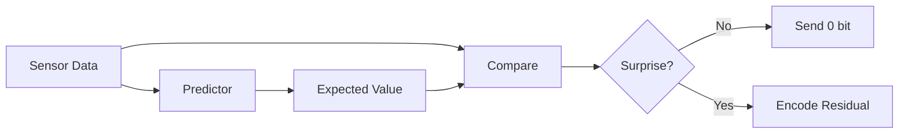
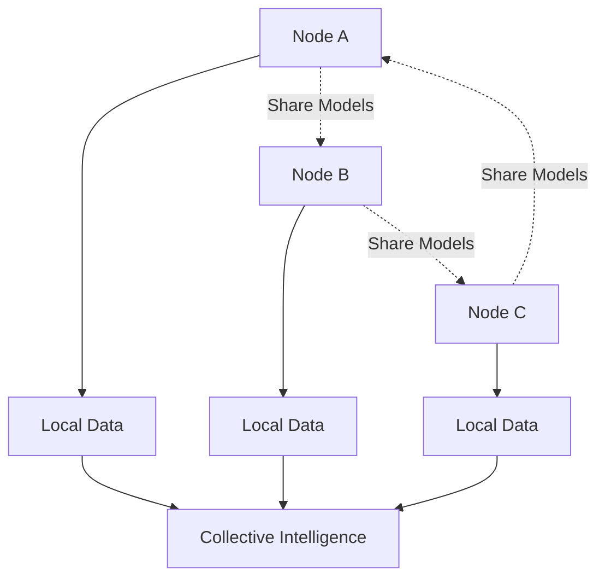

# QRES

> A neural compression engine for time-series data

[](https://doi.org/10.5281/zenodo.18194636)
[](https://orcid.org/0009-0008-9183-1278)
[](LICENSE)
[](https://github.com/CavinKrenik/QRES/actions)
[](https://github.com/CavinKrenik/QRES/releases)

**📄 Paper:** [Download PDF](paper/QRES__Biologically_Inspired_Secure_Federated_Learning_for_Edge_IoT_Devices.pdf) | **🔗 DOI:** [10.5281/zenodo.18194636](https://doi.org/10.5281/zenodo.18194636)

## The Core Idea

What if we compressed data the way brains compress memories—by predicting patterns and encoding only surprises?

QRES started with a simple question: **Can you compress data using only three comparisons: `<`, `>`, `=`?**

That question led to the exploration of predictive compression, deterministic neural networks, and distributed model synchronization.

## How It Works

**Traditional compression:** "How do I represent this data in fewer bits?"  
**QRES approach:** "How often does this data differ from what I expected?"

When encoder and decoder share the same predictor, you only need to transmit the surprises—the moments when reality diverged from expectation.



## Key Features

- **Deterministic Architecture**: Q16.16 fixed-point math ensures bit-perfect reproducibility across x86, ARM, RISC-V, WASM
- **Federated Learning**: Nodes share models peer-to-peer without transmitting raw data
- **Edge-Native**: `no_std` compatible, runs on bare-metal embedded devices
- **Hybrid Runtime**: Seamlessly switch between native performance and portable WebAssembly

## When to Use QRES

| ✅ Use QRES For | ❌ Don't Use QRES For |
|----------------|----------------------|
| IoT telemetry (repetitive sensor data) | High-entropy data (encryption, random) |
| Structured logs (timestamps, patterns) | Existing archives (.zip, .jpg, .mp4) |
| Edge networks (bandwidth > compute cost) | Files < 1KB (header overhead) |
| Archival (deterministic restoration) | Maximum speed (use LZ4) |

## Quick Start

```bash
# Clone and install
git clone https://github.com/CavinKrenik/QRES.git
cd QRES
pip install .

# Compress a file
python3 -c "import qres; print(f'Size: {len(qres.compress(open(\"README.md\", \"rb\").read()))} bytes')"
```

[Full installation docs →](docs/guides/P2P_IMPLEMENTATION.md)

## The Journey

This project evolved through 15 major iterations:

| Version | Milestone |
|---------|-----------|
| v1 | Simple ternary encoding (left/right/equal) |
| v2 | Added delta prediction |
| v3 | Experimented with neural predictors |
| v4 | Switched to SNNs for edge compatibility |
| v8 | P2P swarm architecture |
| v10 | Tensor network correlators, Q16.16 determinism |
| v12 | Federated swarms, zero-bandwidth synchronization |
| v13 | Security hardening: ed25519 signatures, Krum aggregation |
| v14 | Robust aggregation: Multi-Krum, Trimmed Mean, Median |
| v15 | Privacy: Differential Privacy, Secure Aggregation, ZK Proofs |
| v15.2 | Publication Enhancement: Benchmarks, Reproducibility, Paper Draft |

[Read the full story →](docs/PHILOSOPHY.md)

---

## 📄 Publication

**QRES: Biologically-Inspired Secure Federated Learning for Edge IoT Devices**

**Author:** Cavin Krenik [](https://orcid.org/0009-0008-9183-1278)  
**Affiliation:** Olympic College, Shelton, WA, USA  
**Published:** January 2026  
**DOI:** [10.5281/zenodo.18194636](https://doi.org/10.5281/zenodo.18194636)

### Key Results

| Metric | Result |
|--------|--------|
| 🗜️ Compression | 48:1 synthetic, 22:1 IoT telemetry |
| 🔒 Privacy | DP (ε=1.0) + Secure Aggregation + ZK Proofs |
| 🛡️ Byzantine Tolerance | Up to 45% malicious nodes (Krum) |
| ⚡ Overhead | 3.1× runtime for full security stack |
| 📈 Scalability | 10-100 nodes, >85% success rate |

### Citation

```bibtex
@software{krenik2026qres,
  author       = {Krenik, Cavin},
  title        = {{QRES: Biologically-Inspired Secure
                   Federated Learning for Edge IoT Devices}},
  month        = jan,
  year         = 2026,
  publisher    = {Zenodo},
  version      = {v15.2.0},
  doi          = {10.5281/zenodo.18194636},
  url          = {https://doi.org/10.5281/zenodo.18194636}
}
```

---

## Architecture



[See WHITEPAPER.md for technical details →](docs/WHITEPAPER.md)

## Performance

Benchmarks on structured datasets (Intel Ice Lake):

| Dataset | Type | Ratio | Speed |
|---------|------|-------|-------|
| **Sensor Stream** | IoT Telemetry | **~0.045** (22:1) | 85 MB/s |
| **Server Logs** | Text/Time-series | **~0.19** (5.2x) | 200 MB/s |
| **Synthetic Wave** | Model-generated | **~0.02** (48:1) | 120 MB/s |

[Full benchmarks →](docs/BENCHMARKS.md)

## Implementation Status

| Status | Components |
|--------|------------|
| ✅ **Production Ready** | Core engine, Python bindings, WASM decoder |
| 🧪 **Experimental** | Federated dreaming, regime adaptation |
| ✅ **Security Complete** | Authentication (v13), Robust Aggregation (v14), Privacy (v15) |
| 📋 **Roadmap** | Arithmetic coding, FPGA acceleration |

[Detailed status →](docs/IMPLEMENTATION_STATUS.md)

## Project Structure

- `qres_rust/` – Rust workspace containing core engine and daemon
  - `qres_core`: High-performance, `no_std` compression library
  - `qres_daemon`: P2P node and API service
- `python/` – Python bindings and experimental ML models
- `qres-studio/` – Cross-platform GUI (Tauri/Svelte)
- `docs/` – Documentation hub

## Documentation

- [Philosophy & Origin Story](docs/PHILOSOPHY.md)
- [Implementation Status](docs/IMPLEMENTATION_STATUS.md)
- [Technical Deep Dives](docs/TECHNICAL_DEEP_DIVES.md)
- [Security Roadmap](docs/SECURITY_ROADMAP.md)
- [Contributing Guide](docs/CONTRIBUTING.md)

## Frequently Asked Questions

**Q: Is this production-ready?**  
A: The core engine is stable and deterministic. Federated learning is experimental. Security features (authentication, Byzantine-tolerant aggregation, privacy) are **complete** as of v15.2. See [Implementation Status](docs/IMPLEMENTATION_STATUS.md).

**Q: How does this compare to Zstd/Gzip?**  
A: QRES is specialized for repetitive time-series data. For general-purpose compression, use Zstd. QRES shines when data patterns are predictable and bandwidth is constrained.

**Q: Does this use quantum computing?**  
A: No. QRES runs on classical hardware. Early versions had misleading naming that has been removed.

**Q: What's the learning curve?**  
A: For basic use (compress/decompress): low, similar to any compression tool. For federated swarm deployment: moderate, requires understanding of distributed systems.

**Q: Can I use this in production?**  
A: The compression engine is solid. The P2P/federated features now include ed25519 authentication (v13), Byzantine-tolerant Krum aggregation (v14), and differential privacy with ZK proofs (v15). Safe for most environments; production hardening is ongoing.

## License

Apache 2.0 – See [LICENSE](LICENSE)

---

## What I Learned

**Before:** I thought compression was about clever bit-packing  
**After:** Compression is prediction. Better predictions = better compression

**Challenge that surprised me:** Handling regime changes gracefully. Static predictors fail when patterns shift.

**What I'd do differently:** Start with security/Byzantine tolerance from day one. Adding it retroactively is painful.

[Read more about the development journey →](docs/PHILOSOPHY.md)
