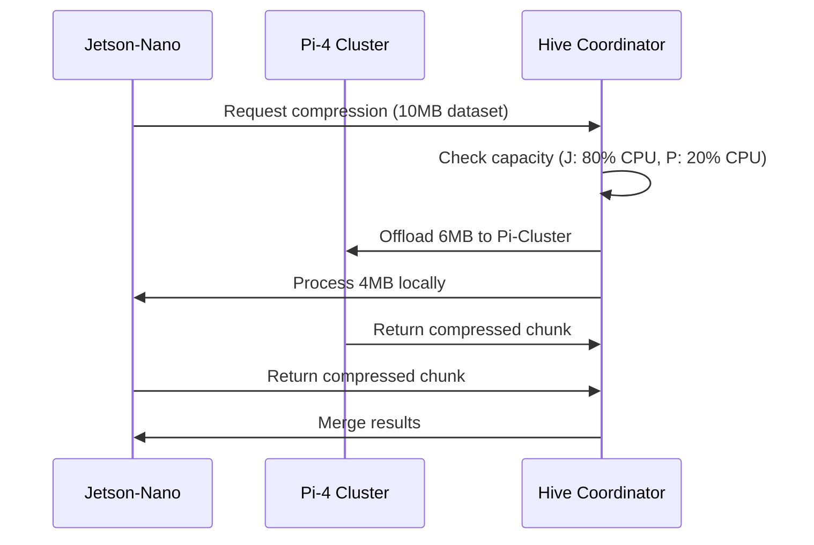

# QRES Edge - Product Roadmap

**Last Updated:** January 11, 2026  
**Current Version:** v15.3.0 (Edge Visualization)

---

## Vision

Transform QRES from a file compression utility into a **real-time edge intelligence platform** that enables seamless neural compression across distributed IoT networks.

---

## Q1 2026 - Browser-to-Edge Bridge

> **Goal:** Solve the Hive Mind browser limitation and enable full Swarm toggling from any client.

### Planned Features

| Feature | Priority | Status |
|---------|----------|--------|
| WebSocket Relay Server | 🔴 Critical | 📋 Planned |
| Browser-Compatible Swarm Protocol | 🔴 Critical | 📋 Planned |
| Authenticated Session Handoff | 🟡 High | 📋 Planned |
| TURN/STUN NAT Traversal | 🟡 High | 📋 Planned |

### Technical Approach

1. **Relay Server**: Lightweight Rust service bridging WebSocket (browser) to libp2p (edge nodes)
2. **Session Auth**: Ed25519 signatures from browser to verify identity with swarm
3. **Fallback Mode**: If relay unavailable, browser continues in simulation mode

### Success Criteria

- [ ] Browser can join live Swarm with ≥95% reliability
- [ ] Latency overhead <50ms vs native P2P
- [ ] Zero additional configuration for end users

---

## Q2 2026 - Deep Hive Integration

> **Goal:** Enable automatic task offloading between heterogeneous edge devices.

### Planned Features

| Feature | Priority | Status |
|---------|----------|--------|
| Device Capability Discovery | 🔴 Critical | 📋 Planned |
| Compression Task Scheduler | 🔴 Critical | 📋 Planned |
| Pi-Cluster Offload from Jetson | 🟡 High | 📋 Planned |
| Battery-Aware Load Balancing | 🟢 Medium | 📋 Planned |
| Remote Model Training | 🟢 Medium | 📋 Planned |

### Technical Approach

1. **Capability Broadcast**: Nodes advertise CPU/GPU/battery via Gossip
2. **Smart Scheduler**: Coordinator splits workloads based on real-time metrics
3. **Chunk Merging**: Deterministic assembly of distributed compression results

### Success Criteria

- [ ] 30% throughput improvement on heterogeneous clusters
- [ ] Energy savings ≥20% on battery-powered nodes
- [ ] Automatic failover within 5s if node goes offline

---

## Q3-Q4 2026 - Future Considerations

| Feature | Description |
|---------|-------------|
| FPGA Acceleration | Offload Mixer logic to hardware |
| Multimodal SNNs | Cross-domain (audio + video) compression |
| Edge Marketplace | Share trained models between organizations |
| Mobile SDK | iOS/Android compression libraries |

---

## Feedback

Submit feature requests via [GitHub Issues](https://github.com/CavinKrenik/QRES/issues) with label `roadmap-request`.
