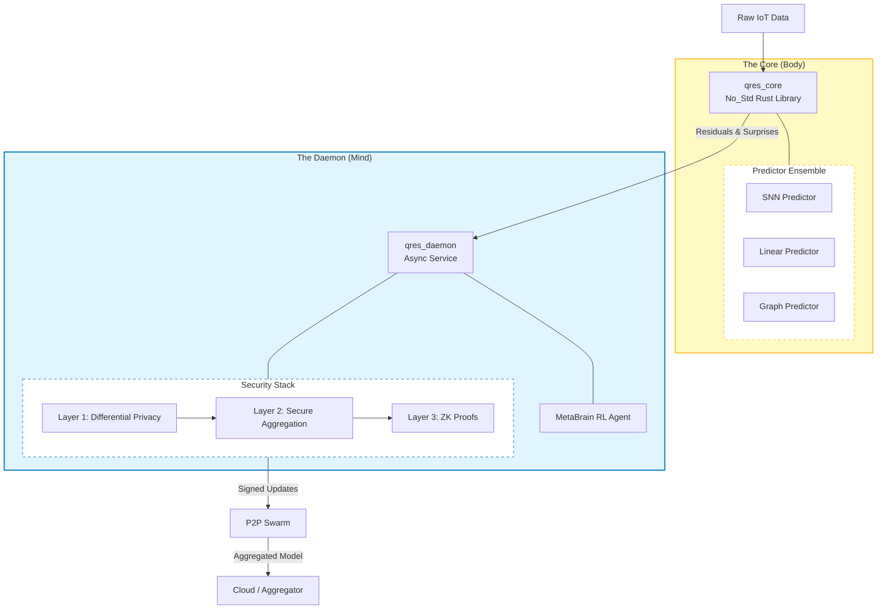

# QRES Theory: The "Living Brain" Architecture

QRES adopts a bio-mimetic architecture that separates deterministic execution (**The Body**) from adaptive learning (**The Mind**). This ensures bit-perfect reproducibility while allowing the system to "dream" and adapt to new data regimes.

## Component Logic

**The Core (Body):** A pure `no_std` Rust library (`qres_core`) that executes the compression codec using a "Zero-Copy Residual" approach. It runs on bare-metal microcontrollers (e.g., STM32, ESP32) or inside WASM sandboxes.

**The Daemon (Mind):** A background service (`qres_daemon`) that handles "Meta-Learning". It uses a PPO-based RL agent to dynamically re-weight predictors and manages the multi-layer security stack (Differential Privacy, Krum Aggregation, ZK Proofs).

## Deployment Environment (Azure)

**Infrastructure Logic:** The QRES Cloud Core operates within a dedicated Virtual Network (QRES-vnet) to ensure secure isolation of training data. The primary node (QRES) is protected by a Network Security Group (QRES-nsg) which strictly filters inbound traffic, allowing only encrypted WebSocket connections from authorized Edge Clients via the static public gateway (QRES-ip). This topology allows for scalable horizontal expansion—additional VM instances can be added to the subnet (default) without altering the public-facing entry point.
